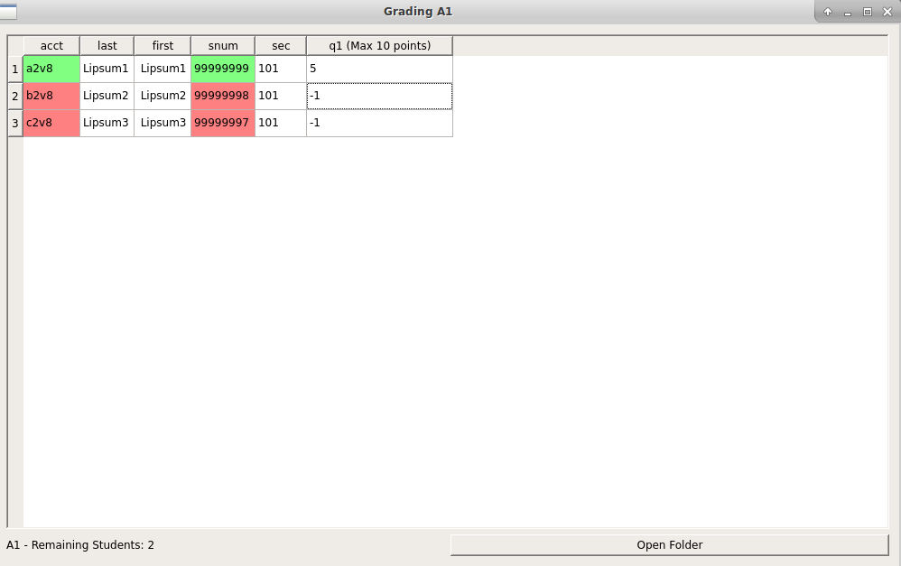

# HomeworkGrader

1. Put the classlist .csv file in the folder **classlists**.

2. Set a new args configuration in `configs.json`, call it **cpsc340_2017W1**.

    1. two configuration examples are in the file: (1) **2016W1**, and (2) **2017W1**
  
    2. `-cl` specifies the classlist file name, `-n` specifies the assignment name, `-q` specifies a list of tuples where the first 
    term in each tuple specifies the question name, and the second term specifies the maximum points for that question
    
    3. If you would like to grade assignment 2 question 1 for classlist `CPSC340_2017W1.csv`, then add the following line in `configs.json`:
        
        1. `"cpsc340_2017W1" : -cl CPSC340_2017W1.csv -n A2 -q (q1,10)`

3. Run`python main.py -c cpsc340_2017W1`, it should launch a grade sheet similar to the one below:

4. The following are several features of the grade sheet:
  
    1. The green color represents graded students. 
  
    2. The red color represents the remaining students to grade.
  
    3. You can sort a column by clicking the column header.
  
    4. Whenever you edit the grade sheet, it gets saved in the folder **grade_sheets**
    
    5. If the submitted pdf files are in **submissions**, then the button **Open Folder** should open 
     the submission folder corresponding to the student in the selected row in the table.
